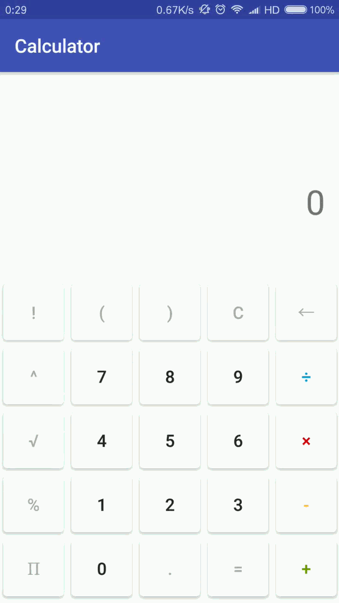

# Calculator
A simple calculator for Android

### Demo

### Download
You may download the android apk file <a href="http://envoy-public.oss-cn-shenzhen.aliyuncs.com/runnable/calculator.apk" target="_blank">here</a>, or scan the QR code below:

### License
<a href="https://github.com/lonelyenvoy/Calculator/blob/master/LICENSE" target="_blank">The Apache-2.0 License</a>
